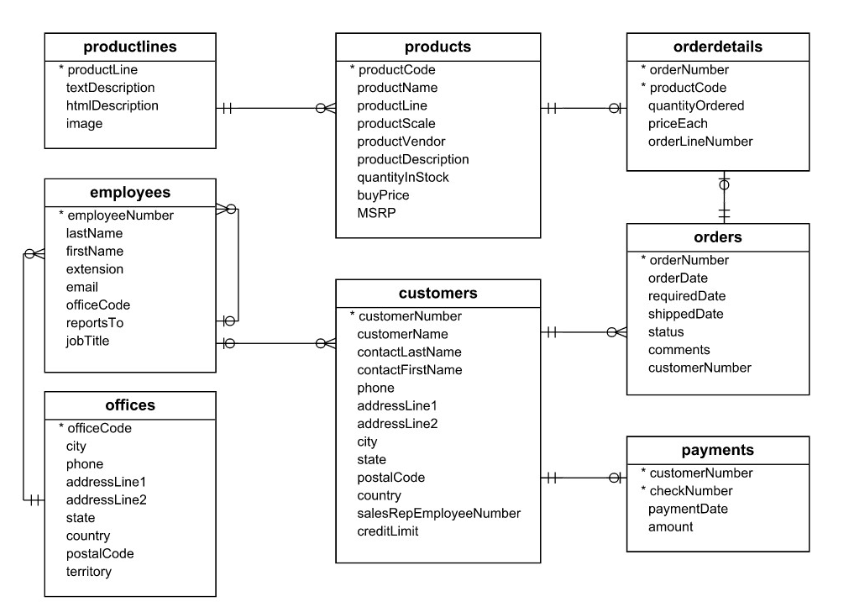

## Rest vs GraphQL vs Grpc

### 1. REST APIs

### 3. gRPC Server
gRPC is a high performance, open source RPC framework developed by Google where a client application can directly call a server method as if it was a local object.Clients invoke a method on the Stub, which gets transparently handled by the underlying protocol.

gRPC’s secret sauce lies in the way the serialization is handled. It is based on Protocol Buffers, an open source mechanism for serializing structured data, which is language and platform neutral. Similar to XML, Protocol Buffers are verbose and descriptive. But they are smaller, faster, and more efficient than other wire-format protocols. Any custom data type that needs to be serialized will be defined as a Protocol Buffer in gRPC.

When compared to REST+JSON combination, gRPC offers better performance and security. It heavily promotes the use of SSL/TLS to authenticate the server and to encrypt all the data exchanged between the client and the server.

Why should microservices developers use gRPC? It uses HTTP/2 to support highly performant and scalable APIs. The use of binary rather than text keeps the payload compact and efficient. HTTP/2 requests are multiplexed over a single TCP connection, allowing multiple concurrent messages to be in flight without compromising network resource usage. It uses header compression to reduce the size of requests and responses.

Developing gRPC project contains 3 steps,

Create proto -> Generate gRPC related classes(Using Plugin) -> Extends generated gRPC classes

### Ecommerce Database

- Database-Diagram

